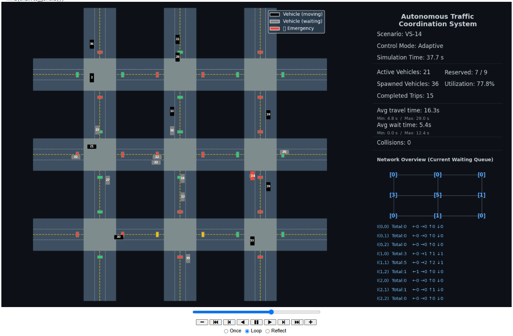

# Autonomous Traffic Coordination Simulation
**Reservation-Based Traffic Coordination Framework (RBTCF)**

Python • Agent-Based Simulation • Traffic Coordination

## Overview

This repository contains the simulation environment developed for the Autonomous Traffic Coordination project.

The simulation models an urban traffic network with autonomous vehicles and intelligent intersections. 
The objective is to evaluate reservation-based traffic coordination and compare fixed and adaptive traffic-light control strategies under various traffic scenarios.

The simulator focuses on:
- Agent-based traffic coordination
- Intersection management
- Reservation-based conflict prevention
- Adaptive traffic light control
- Performance evaluation using traffic metrics

The simulator represents an abstract traffic environment and does not include real vehicle hardware or real-world sensor data.




## Implemented Control Strategies
### Fixed Traffic Light Control
A traditional traffic light mechanism:
- Green/red phases change according to a fixed time interval.
- No adaptation to current traffic conditions.

### Adaptive Traffic Light Control
A dynamic strategy:
- Green phases are selected according to current queue lengths.
- The controller prioritizes intersections with higher traffic demand.


## Features
- Agent-based traffic simulation
- Autonomous vehicle agents
- Intelligent intersection controllers
- Reservation mechanism
- Emergency priority
- Automated experiment execution
- Data export to CSV format
- Result visualization and graph generation

The simulation generates:
- Performance measurements
- Comparison results
- Visualization graphs
- Statistical summaries


## Architecture
The simulation consists of the following main components:
- **Vehicle Agent** – Handles vehicle movement, routing, and interaction with intersections.
- **Intersection Controller** – Manages traffic flow and coordination decisions.
- **Reservation Manager** – Allocates intersection reservations and prevents conflicts within shared intersection zones.
- **Traffic Light Controller** – Implements fixed and adaptive traffic control policies.

These components are implemented within the main simulation file (`simulation.py`).


## Requirements
- Python 3.x

Required Python packages:
- numpy
- matplotlib
- pandas


## Running the Simulation
### Install required libraries
```bash
pip install numpy matplotlib pandas
```

### Run the simulator:
```bash
python simulation.py
```

### Execution Environment

The project was developed and evaluated using Google Colab / Jupyter Notebook.

The simulator visualization is generated using:

```python
HTML(anim.to_jshtml())
```

which is supported by notebook environments.

When executed from a standard Python terminal, the simulation logic executes normally, but the interactive animation is not displayed. The accompanying video demonstration presents the simulator's graphical execution.


## Experiments
The simulation was evaluated using multiple traffic scenarios with different traffic loads and configurations.

The experiments compare:
- Fixed traffic light control
- Adaptive traffic light control
- Traffic performance under increasing load


## Results
Results include:
- Average travel time comparison
- Average waiting time analysis
- System utility evaluation
- Collision analysis
- Scalability analysis

The adaptive controller provides the greatest benefit under low and moderate traffic demand, while reservation-based coordination remains the primary safety mechanism under heavy congestion.

Detailed experimental results are available in the accompanying project report.


## Project Structure
```
simulation/
├── simulation.py          # Main simulation implementation
├── experiments/           # Experiment scripts and validation tests
├── outputs/               # Generated experiment data and results
│   ├── csv/               # Experiment results in CSV format
│   └── plots/             # Generated graphs and visualizations
├── documentation/         # System design diagrams and models
│   ├── PlantUML code/     # PlantUML diagrams
│   ├── PNG files/         # PNG diagrams
│   └── SVG files/         # SVG diagrams
└── README.md
```

## Output Files
The simulation produces:
- CSV files containing generated experiment results
- Visualization plots for performance analysis


## Video Demonstration
A complete demonstration of the simulator is available on YouTube:

https://www.youtube.com/watch?v=MXEq_WkcRFM

## Academic Project
This simulation was developed as part of the course project for the Engineering of Autonomous Multi-Agent Systems course in the M.Sc. Software Engineering program at Shenkar College of Engineering, Design and Art.
